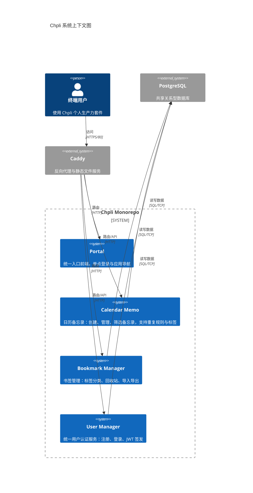
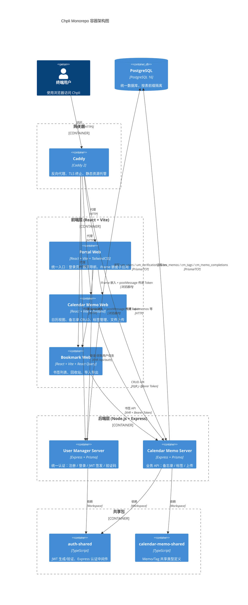
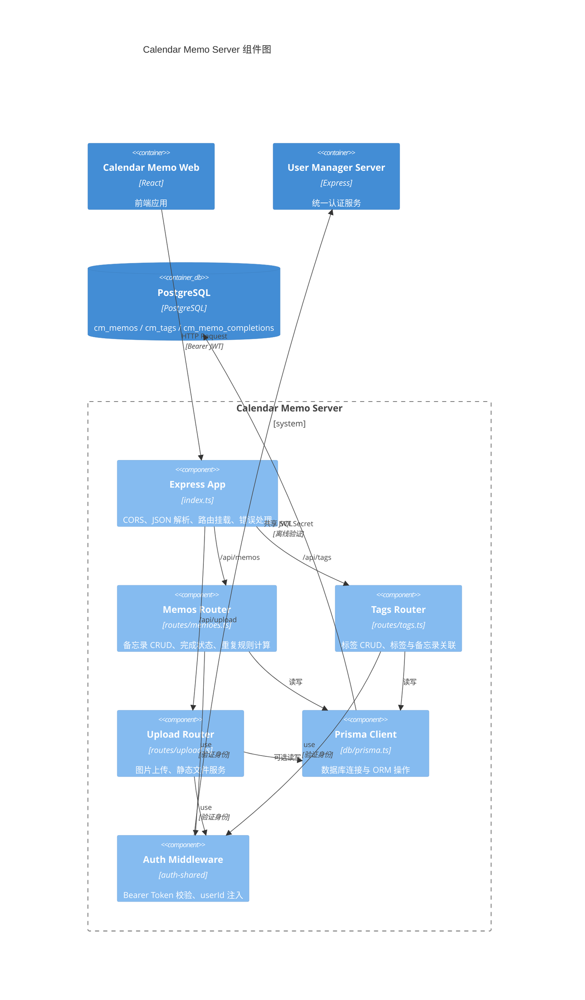
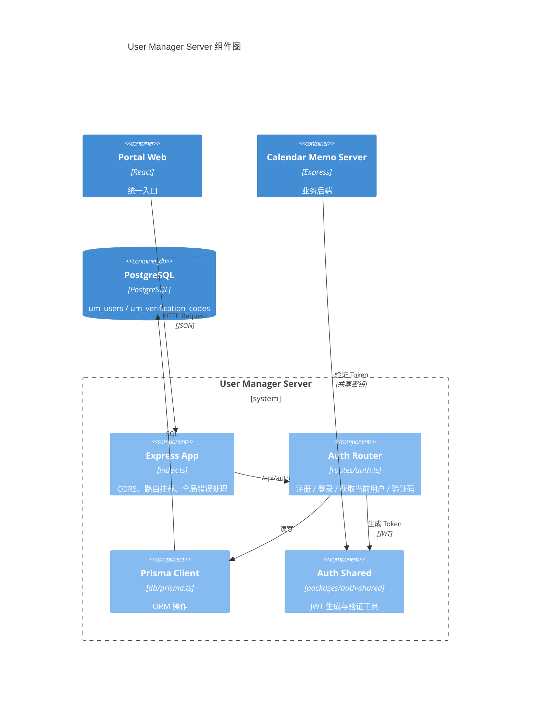
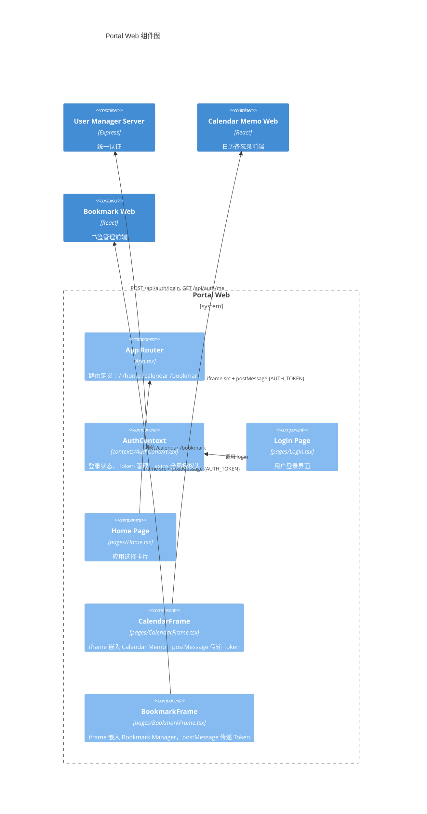
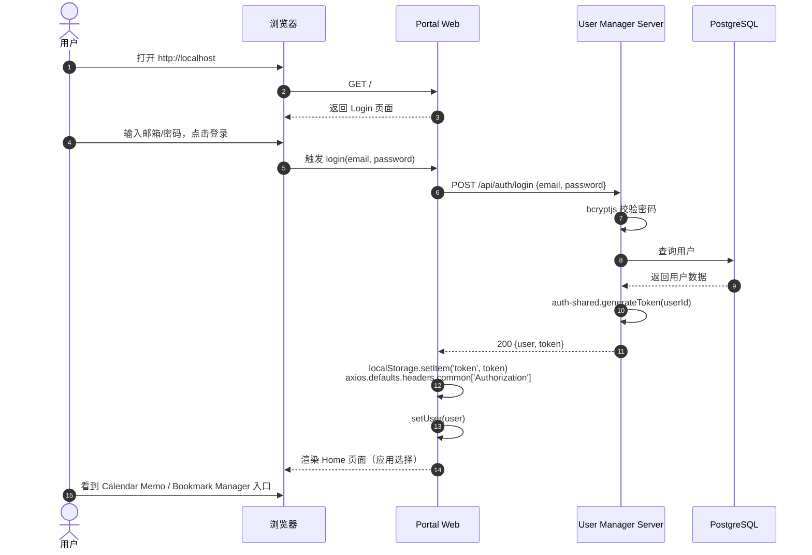
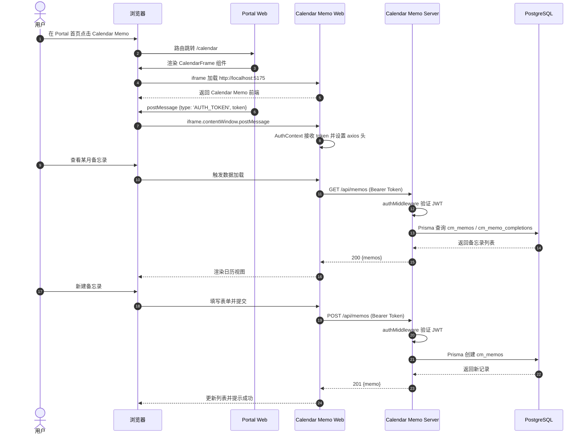
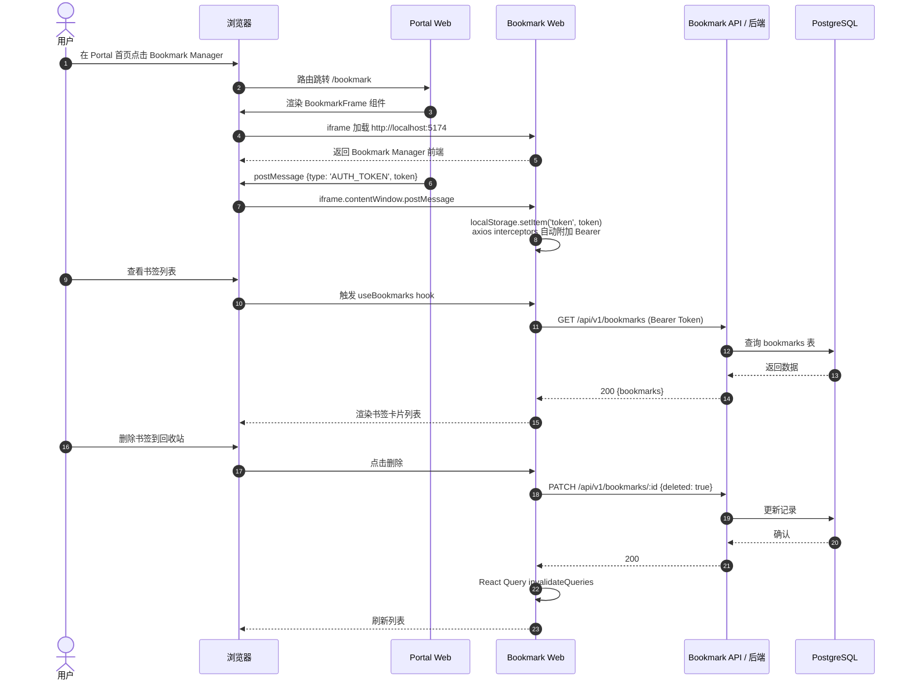
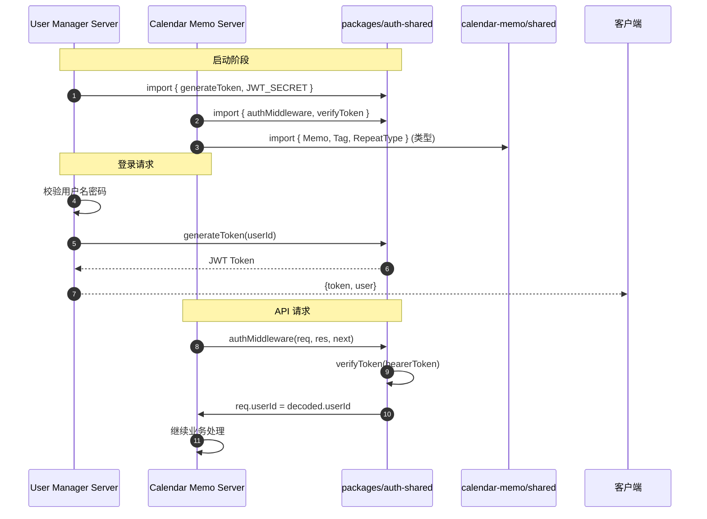
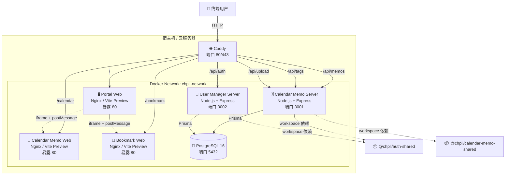

# Chpli Monorepo 架构图

> 本文档使用 Mermaid 语法描述 Chpli Monorepo 的系统上下文、容器、组件及交互序列。

---

## 1. 系统上下文图 (System Context)

---

## 2. 容器图 (Container)

---

## 3. 组件图 (Component)

### 3.1 Calendar Memo Server 组件图

### 3.2 User Manager Server 组件图

### 3.3 Portal Web 组件图

---

## 4. 交互序列图

### 4.1 用户登录与访问 Portal 首页

### 4.2 通过 Portal 访问 Calendar Memo（iframe + API 全流程）

### 4.3 通过 Portal 访问 Bookmark Manager（iframe 模式）

### 4.4 Workspace 共享包依赖关系

---

## 5. 部署拓扑图 (Deployment)

---

## 附录：技术栈速查

| 层级 | 技术 |
|------|------|
| **前端框架** | React 18 + TypeScript + Vite |
| **前端状态** | Zustand (Calendar), React Query (Bookmark) |
| **UI 样式** | TailwindCSS + Lucide React |
| **后端框架** | Express 4 + TypeScript |
| **ORM / 数据库** | Prisma 5 + PostgreSQL 16 |
| **认证** | JWT (jsonwebtoken) + bcryptjs |
| **反向代理** | Caddy 2 |
| **包管理 / Monorepo** | pnpm 10 + Workspaces |
| **容器化** | Docker + Docker Compose |
